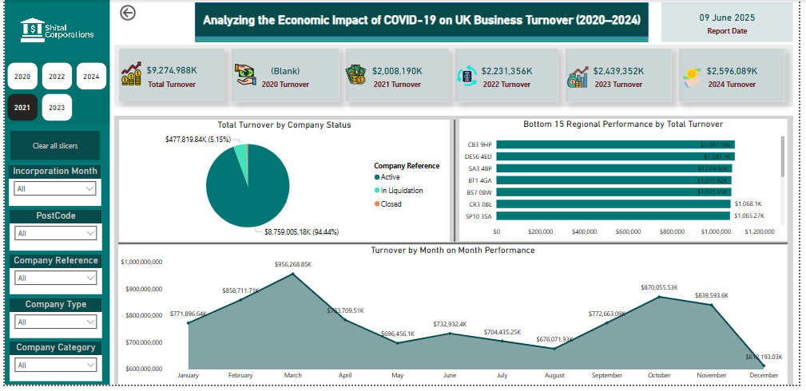

# Project 1

**Title:** [TURNOVER INTERACTIVE REPORT](https://github.com/Tola-Analyst-hub/github.io/blob/main/Shital%20Corporations%20Report.pbix)

**Tools Used:** SQL, POWERBI (Slicers, Pivot Chart, DAX, Bar Chart, Visual Header Tooltips, Measures)

**Project Description:**
This project involves a comprehensive analysis and visualization of UK business turnover data across different company types, statuses, and regions using a tax-related dataset. The purpose was to investigate how the COVID-19 pandemic and the subsequent recovery phase affected business turnover across various sectors and geographic locations.
I developed SQL queries to clean, transform, and analyze the dataset and used Power BI to visualize key performance indicators (KPIs). The insights provided stakeholders with a clear view of business performance trends during and after the COVID period.

**Business Objective**
To evaluate the economic impact of COVID-19 and post-pandemic recovery on UK business turnover.
To identify which sectors and regions drove growth or experienced decline during 2020–2024.
To aid government departments or financial institutions in identifying vulnerable sectors and potential areas for support or investment.

**Problems Addressed:**
Understanding how different company types (e.g., Retail, Farming, Manufacturing) performed financially from 2020 to 2024.
Measuring turnover changes year-on-year by sector and company status (Active, Closed, In Liquidation).
Identifying regional disparities in business performance using total turnover as a benchmark.
Assessing business incorporation behavior through analysis of incorporation months.

**Key findings:** 

Using SQL and Power BI, the following insights and KPIs were delivered:
1. Turnover Change Between 2020–2024 by Company Type: Showed growth trends by sector.
2. Top 15 Regional Performance by Total Turnover: Identified high-performing regions.
3. Bottom 15 Regional Performance by Total Turnover: Highlighted underperforming regions.
4. Sectors Showing Greatest Increase and Decrease Over the Years: Offers a snapshot of sectoral impact.
5. Total Turnover by Company Status: Compared turnover performance between active, closed, and liquidated businesses.
6. Turnover by Month-on-Month Performance: Provided time series trends in business turnover.

SQL-Based Questions Addressed:
1. Which sectors show the greatest increase and decrease in turnover over the years available?
2. What is the total turnover for “Farming” broken down by year?
3. What is the LEAST common month to incorporate a business? Is this true for all Company Types?

**Dashboard Overview:** 

**SQL Code:**
[Turnover SQL Code](https://github.com/Tola-Analyst-hub/github.io/blob/main/Turnover.sql)

# Project 2

**Title:** Employee Data Interrogation and Manipulations 

**SQL Code:**
[Employee SQL Code](https://github.com/Tola-Analyst-hub/github.io/blob/main/Employee.sql)

**SQL Skills Used:** 
Data Retrieval (SELECT): Queried and extracted specific information from the database.
Data Aggregation (SUM, COUNT): Calculated totals, such as sales and quantities, and counted records to analyze data trends.
Data Filtering (WHERE, BETWEEN, IN, AND): Applied filters to select relevant data, including filtering by ranges and lists.
Data Source Specification (FROM): Specified the tables used as data sources for retrieval

**Project Description:**
This project involved performing structured SQL queries and analytics on an employee dataset to uncover critical workforce patterns such as employee-manager salary relationships, department-level compensation rankings, and headcount distribution. The dataset consisted of employees’ personal and professional data, including names, departments, salaries, job roles, and reporting lines. Using SQL, advanced insights were extracted to support HR decisions, compensation planning, and leadership visibility

**Business Objective**
To support the HR and executive leadership team with data-driven insights by:
Identifying compensation discrepancies (e.g., employees earning more than their managers)
Highlighting top earners across departments
Enabling departmental headcount planning
Providing a reusable SQL logic base for scalable employee data analysis

**Key Outcome**
Using SQL (including self-joins, common table expressions (CTEs), and aggregate functions), the following business questions were answered among others:
1. Employees earning more than their managers
Using a self-join on the employee table, we identified discrepancies in the managerial pay hierarchy.

2. Top earners in each department
Used RANK() and DENSE_RANK() window functions to extract the highest and top 3 earners in every department, enabling better compensation visibility.

3. Headcount by department
Applied GROUP BY and COUNT() to generate workforce distribution reports, aiding capacity planning, etc.

**Technology used:** SQL server
